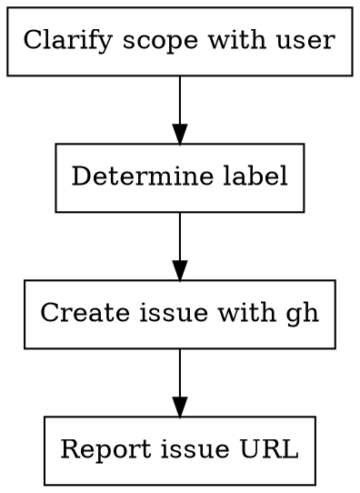

# Git Issue

사용자가 설명한 작업을 GitHub Issue로 생성하는 스킬.

## Process



### Step 1: 요구사항 정리

사용자의 설명에서 다음을 추출:
- **제목**: 간결하고 명확한 한 줄
- **본문**: 구현할 내용, 배경, 조건 등
- **라벨**: 아래 표 참고

불명확한 부분이 있으면 사용자에게 확인한다.

### Step 2: Issue 생성

```bash
gh issue create --title "<title>" --label "<label>" --body "$(cat <<'EOF'
## Description
<작업 설명>

## Tasks
- [ ] 구현 항목 1
- [ ] 구현 항목 2

## Acceptance Criteria
- 완료 조건
EOF
)"
```

### Step 3: 결과 보고

생성된 Issue URL과 번호를 사용자에게 알려준다.
바로 구현을 시작하려면 `git/pr` 스킬로 이어갈 수 있음을 안내한다.

## Quick Reference

| 작업 유형 | 라벨 | 제목 prefix |
|----------|------|------------|
| 버그 수정 | `bug` | `[Bug]` |
| 새 기능 | `enhancement` | `[Feature]` |
| 문서화 | `documentation` | `[Docs]` |
| 리팩토링 | `refactor` | `[Refactor]` |

## Common Mistakes

- **제목이 너무 추상적**: "수정 필요" → "인기 동영상 API 응답 캐싱 추가"
- **본문 없이 제목만**: 다른 사람이 맥락을 알 수 없음
- **라벨 미설정**: 분류 불가 — 항상 적절한 라벨 지정
