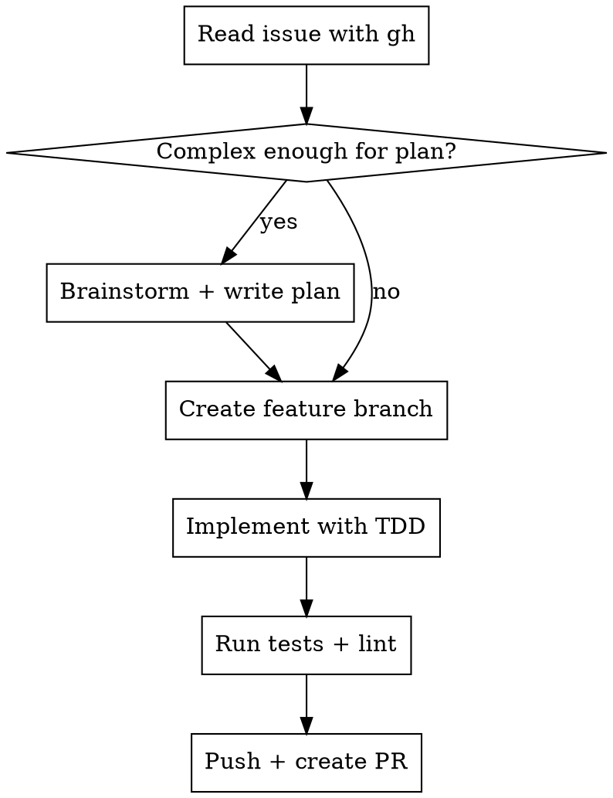

# Git PR

GitHub Issue를 기반으로 브랜치 생성 → 구현 → PR 생성까지의 워크플로우.

## Process



### Step 1: Issue 읽기

```bash
gh issue view <NUMBER>
```

Issue의 제목, 본문, 라벨을 확인하여 범위를 파악한다.

### Step 2: 복잡도 판단

- **단순** (1-2 파일, 명확한 요구사항): 바로 브랜치 생성 후 구현
- **복잡** (3+ 파일, 설계 필요): brainstorming → writing-plans 스킬 사용

### Step 3: 브랜치 생성

```bash
git checkout -b <prefix>/#<issue-number>-<short-description> main
```

### Step 4: 구현

- **REQUIRED SUB-SKILL:** superpowers:test-driven-development
- 복잡한 경우: superpowers:subagent-driven-development 또는 superpowers:executing-plans

### Step 5: PR 생성

```bash
gh pr create --title "<type>: <description>" --body "$(cat <<'EOF'
## Summary
<변경 사항 요약>

Closes #<ISSUE_NUMBER>

## Test Plan
- [ ] 테스트 항목

Generated with [Claude Code](https://claude.com/claude-code)
EOF
)"
```

**`Closes #N`은 필수** — PR 머지 시 이슈 자동 close.

## Quick Reference

| Issue 라벨 | 브랜치 prefix | PR title prefix |
|-----------|--------------|----------------|
| bug | `fix/` | `fix:` |
| enhancement, feature | `feature/` | `feat:` |
| documentation | `docs/` | `docs:` |
| refactor | `refactor/` | `refactor:` |

## Common Mistakes

- **`Closes #N` 누락**: PR이 이슈를 자동으로 닫지 않음
- **Issue 안 읽고 시작**: 요구사항 놓침 — 항상 `gh issue view` 먼저
- **브랜치 이름에 이슈 번호 빠짐**: 추적성 상실
